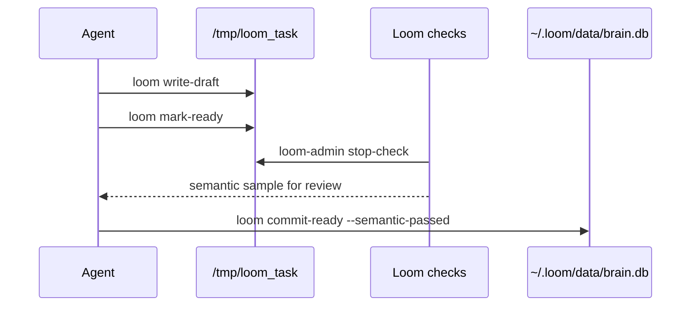

# Loom

**Language:** English | [简体中文](README.zh-CN.md)

Loom is a local-first cognitive harness for AI agents. It turns books, notes,
articles, transcripts, and working thoughts into a layered card network that an
agent can search, read, connect, and safely extend.

The short version: Loom is not a chatbot memory dump. It is a small operating
system for building an agent-readable second brain.


## Why Loom Exists

Most personal knowledge tools store text for humans. Most agent memory systems
store snippets for retrieval. Loom tries a different shape:

- **Local-first:** your card database, source material, and API keys stay on
  your machine under `~/.loom` or `LOOM_HOME`.
- **Layered:** raw material, material-level understanding, cross-material
  synthesis, and meta-patterns are separate layers with different rules.
- **Agent-safe:** agents write drafts first; checks and state-machine gates run
  before anything enters the database.
- **Traceable:** every generated thought can link back to source cards and
  supporting cards.
- **Interactive:** the Workbench UI lets you browse the card graph visually.

## The Mental Model

Loom has four layers:

| Layer | Meaning | Example |
|---|---|---|
| `L1` | Faithful source capture | A chapter converted to Markdown |
| `L2` | Digest of one material | A concept, mechanism, case, or judgment from that chapter |
| `L3` | Cross-material thinking | A synthesis that links several L2 cards |
| `L4` | Meta-level pattern | A reusable thinking pattern, judgment, or reflection |

The agent does not write directly into the database. It writes drafts into a
task workspace, then Loom checks the drafts before commit:



This design keeps the system useful for autonomous agents while still making
the important state transitions visible and auditable.

## Repository Layout

```text
bin/                  Shell wrappers for local checkouts
src/loom/             Python package: CLI, storage, checks, embeddings
skills/               Agent skills for digesting, thinking, and using Loom
workbench/            Optional FastAPI + Vue graph browser
docs/design/          Public design baseline
config/               Example hook configuration
tests/                CLI and harness regression tests
```

Private data is intentionally not part of the repository:

```text
~/.loom/data/         SQLite database and derived indexes
~/.loom/cards/        Markdown card mirrors
~/.loom/sources/      Local source material
/tmp/loom_task/       Draft task workspaces
```

## Install

Loom currently targets Python 3.11.

Recommended full install:

```bash
git clone git@github.com:q8886b/loom.git
cd loom
./install.sh
```

`install.sh` checks Python runtime dependencies, creates `~/.loom`, installs
CLI links, installs agent skills, and installs Claude Code / Codex stop-check
hooks. The hooks are guarded by `loom on`, so they stay silent outside projects
you activate:

```bash
./install.sh             # full install with global hooks
./install.sh --no-hooks  # CLI/skills only; manual stop-check fallback
./install.sh --project   # project-local hooks for this checkout
```

For editable package development:

```bash
python3.11 -m pip install -e ".[dev]"
```

Add your embedding key:

```bash
cp .env.example ~/.loom/.env
# edit ~/.loom/.env and set ZHIPU_API_KEY
```

Without an embedding key, L1 import and FTS search still work; vector and
hybrid search need `ZHIPU_API_KEY`.

You can keep multiple isolated Loom homes:

```bash
LOOM_HOME=/path/to/sandbox loom stats
```

Smoke test:

```bash
loom stats
loom on      # enable hooks for the current project
loom off     # disable hooks for the current project
```

## Quick Start

Create a source Markdown file and register it as an L1 source card:

```bash
mkdir -p ~/.loom/sources/07-LLM/demo
cat > ~/.loom/sources/07-LLM/demo/ch01.md <<'EOF'
# Harness Notes

A harness is the surrounding system that turns a model into a reliable agent.
EOF

loom import-source llm:demo:src:01 \
  --title="Harness Notes - Chapter 1" \
  --path="$HOME/.loom/sources/07-LLM/demo/ch01.md"
```

Read and search:

```bash
loom read-source llm:demo:src:01
loom search "reliable agent" --mode=fts
loom orient
```

For agent-driven digestion, use the skills in `skills/`:

- `loom-digest`: turn L1 source material into L2 cards
- `loom-think`: synthesize L3/L4 cards from the existing network
- `loom-use`: answer concrete questions with the card network
- `loom-pipeline`: orchestrate larger end-to-end runs

## Workbench

The optional Workbench is a local graph browser for the card network.

Backend:

```bash
python3.11 -m pip install -e ".[workbench]"
python3.11 workbench/backend/main.py
```

Frontend:

```bash
cd workbench/frontend
npm install
npm run dev
```

Open <http://127.0.0.1:8888>.

Security note: the Workbench API exposes card content and is intended for
localhost use. Do not serve it on a public interface without authentication.

## Internationalization

The default README is English. A Simplified Chinese README is maintained at
[README.zh-CN.md](README.zh-CN.md). User-facing public documentation should be
kept bilingual when it explains installation, concepts, security, or
maintenance workflows.

## Design Documents

Start here:

- [004 - Layered Redesign Purpose](docs/design/004-layered-redesign-purpose.md)
- [005 - Layered Redesign Harness](docs/design/005-layered-redesign-harness.md)

These two files define what Loom is trying to become and how the harness makes
that design executable.

## Development

```bash
python3.11 -m pip install -e ".[dev]"
pytest
```

Frontend production dependency audit:

```bash
cd workbench/frontend
npm audit --omit=dev
```

## Open Source Hygiene

Before publishing or opening a pull request, make sure these commands do not
show private data:

```bash
git status --short
git ls-files data cards sources .loom-local docs/research
```

If this repository was previously used as a personal workspace, publish from a
fresh clone or a clean public repository. Do not push old Git objects that may
contain private databases, source material, or copyrighted notes.

## License

MIT. See [LICENSE](LICENSE).
