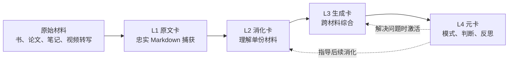
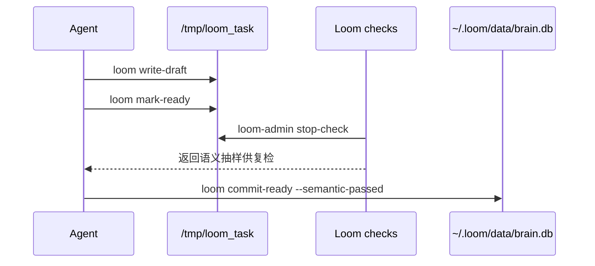

# Loom

**语言：** [English](README.md) | 简体中文

Loom 是一个本地优先的 AI agent 认知 harness。它把书、笔记、文章、视频转写和工作中的想法，组织成 agent 可以检索、阅读、链接和安全扩展的分层卡片网络。

一句话：Loom 不是聊天机器人的记忆缓存，而是一个用于构建“agent 可读第二大脑”的小型操作系统。



## Loom 解决什么问题

多数个人知识工具是给人存文本。多数 agent 记忆系统是给检索存片段。Loom 选择另一种形态：

- **本地优先**：卡片库、源材料和 API Key 默认都在本机 `~/.loom` 或 `LOOM_HOME` 下。
- **分层组织**：原文、单份材料理解、跨材料综合、元模式分别处在不同层，有不同约束。
- **agent 友好且安全**：agent 先写 draft，再经过检查和状态机门禁，最后才入库。
- **可追溯**：生成的判断和模式可以回链到 source card 与支撑卡。
- **可浏览**：Workbench UI 可以用图谱方式浏览卡片网络。

## 核心模型

Loom 有四层：

| Layer | 含义 | 例子 |
|---|---|---|
| `L1` | 忠实保存原文 | 一章书转成 Markdown |
| `L2` | 消化单份材料 | 该章里的概念、机制、案例、判断 |
| `L3` | 跨材料思考 | link 多张 L2 后形成的综合判断 |
| `L4` | 元层模式 | 可复用的思考模式、判断或反思 |

agent 不直接写数据库，而是先写 task draft，再经过 Loom 检查：



这样既能让 agent 自主工作，又能让关键状态变化保持可观察、可审计。

## 仓库结构

```text
bin/                  本地 checkout 使用的 shell wrapper
src/loom/             Python 包：CLI、存储、校验、embedding
skills/               消化、思考、使用 Loom 的 agent skills
workbench/            可选 FastAPI + Vue 图谱浏览器
docs/design/          公开设计基准
config/               hook 配置示例
tests/                CLI 与 harness 回归测试
```

私有数据不属于仓库：

```text
~/.loom/data/         SQLite 数据库和派生索引
~/.loom/cards/        Markdown 卡片镜像
~/.loom/sources/      本地源材料
/tmp/loom_task/       draft 任务工作区
```

## 安装

Loom 当前面向 Python 3.11。

推荐的完整安装方式：

```bash
git clone git@github.com:q8886b/loom.git
cd loom
./install.sh
```

`install.sh` 会检查 Python 运行依赖，创建 `~/.loom`，安装 CLI 链接、agent skills，以及 Claude Code / Codex stop-check hooks。hooks 受 `loom on` 保护，未激活的项目里会静默退出：

```bash
./install.sh             # 完整安装，含全局 hooks
./install.sh --no-hooks  # 只安装 CLI/skills，手动 stop-check 兜底
./install.sh --project   # 只给当前 checkout 安装项目级 hooks
```

如果要以可编辑 Python 包方式开发：

```bash
python3.11 -m pip install -e ".[dev]"
```

添加 embedding key：

```bash
cp .env.example ~/.loom/.env
# 编辑 ~/.loom/.env，填写 ZHIPU_API_KEY
```

没有 embedding key 时，L1 导入和 FTS 检索仍可使用；vector / hybrid 检索需要 `ZHIPU_API_KEY`。

也可以隔离多个 Loom home：

```bash
LOOM_HOME=/path/to/sandbox loom stats
```

冒烟测试：

```bash
loom stats
loom on      # 为当前项目启用 hooks
loom off     # 为当前项目关闭 hooks
```

## 快速开始

创建一个 Markdown 源文件，并注册成 L1 原文卡：

```bash
mkdir -p ~/.loom/sources/07-LLM/demo
cat > ~/.loom/sources/07-LLM/demo/ch01.md <<'EOF'
# Harness Notes

A harness is the surrounding system that turns a model into a reliable agent.
EOF

loom import-source llm:demo:src:01 \
  --title="Harness Notes - Chapter 1" \
  --path="$HOME/.loom/sources/07-LLM/demo/ch01.md"
```

读取和检索：

```bash
loom read-source llm:demo:src:01
loom search "reliable agent" --mode=fts
loom orient
```

agent 驱动的消化与思考使用 `skills/` 下的技能：

- `loom-digest`：把 L1 原文材料消化成 L2 卡
- `loom-think`：基于现有网络生成 L3/L4 卡
- `loom-use`：用卡片网络回答具体问题
- `loom-pipeline`：编排更大的端到端流程

## Workbench

Workbench 是可选的本地图谱浏览器。

后端：

```bash
python3.11 -m pip install -e ".[workbench]"
python3.11 workbench/backend/main.py
```

前端：

```bash
cd workbench/frontend
npm install
npm run dev
```

打开 <http://127.0.0.1:8888>。

安全提示：Workbench API 会暴露卡片内容，设计目标是 localhost 使用。不要在没有认证的情况下把它绑定到公网接口。

## 国际化

默认 README 是英文，简体中文版本是 [README.zh-CN.md](README.zh-CN.md)。面向公开用户的安装、概念、安全和维护文档，应尽量保持中英双语。

## 设计文档

建议先读：

- [004 - 分层重设计：目的与思想](docs/design/004-layered-redesign-purpose.md)
- [005 - 分层重设计的 Harness 落地](docs/design/005-layered-redesign-harness.md)

这两份定义了 Loom 要成为什么，以及 harness 如何把设计变成可执行现实。

## 开发

```bash
python3.11 -m pip install -e ".[dev]"
pytest
```

前端生产依赖审计：

```bash
cd workbench/frontend
npm audit --omit=dev
```

## 开源卫生

发布或提交 PR 前，确认这些命令不会显示私有数据：

```bash
git status --short
git ls-files data cards sources .loom-local docs/research
```

如果这个仓库曾经长期作为个人工作区使用，建议从 fresh clone 或干净 public repo 发布。不要把旧 Git objects 里的私有数据库、源材料或版权笔记推到公开仓库。

## License

MIT。见 [LICENSE](LICENSE)。
